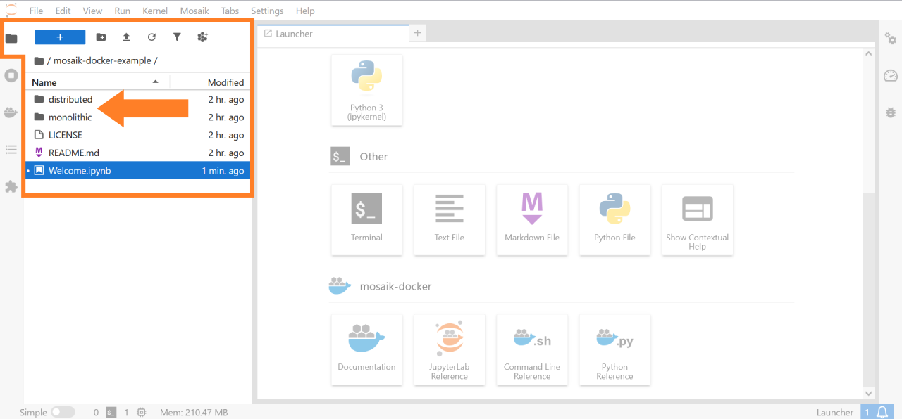

********************************************************
Example for using the mosaik-docker JupyterLab extension
********************************************************

The `mosaik-docker-demo <https://github.com/ERIGrid2/mosaik-docker-demo/>`_ repository contains two simulation setups that demonstrate the deployment of the `mosaik co-simulation framework <https://mosaik.offis.de/>`_ with `Docker <https://docs.docker.com/>`_.
To run these examples, packages `mosaik-docker <https://mosaik-docker.readthedocs.io/en/latest/installation.html>`_ and `Docker <https://docs.docker.com/>`_ have to be installed.
For running the examples from JupyterLab, package `mosaik-docker-jl <https://mosaik-docker.readthedocs.io/projects/jupyter/en/latest/installation.html>`_ needs to be installed.

You can get the examples via git.
In JupyterLab, you can open a terminal and clone the repository:

.. code-block:: bash

    git clone https://github.com/ERIGrid2/mosaik-docker-demo.git

The repository contains two simulation setups:

* A **monolithic setup** is available in folder ``monolithic``.
  The mosaik scenario file, all simulators and all aditional resources are added to a single Docker image.
  When running a simulation, a single container is instantiated from this image and executed on its own.
* A **distributed setup** is available in folder ``distributed``.
  The mosaik scenario file and the simulators can be added to separate Docker images.
  When running a simulation, an individual container is instantiated from each of these images.
  At runtime, these containers are executed in parallel and communicate with each other (via the `mosaik API <https://mosaik.readthedocs.io/en/latest/mosaik-api>`_).

