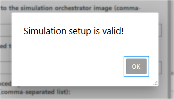

********************************************
Using the mosaik-docker JupyterLab extension
********************************************

Overview
========

The *mosaik-docker JupyterLab extension* integrates package `mosaik-docker <https://mosaik-docker.readthedocs.io/en/latest/index.html>`_ into the interactive `JupyterLab <https://jupyter.org/>`_ environment.
This allows to use *mosaik-docker* in three possible ways:

#. `Use JupyterLab's graphical user interface`_
#. `Use a JupyterLab Python notebook`_
#. `Use a JupyterLab terminal`_

An introduction to the *basic workflow* of package *mosaik-docker* can be found `here <https://mosaik-docker.readthedocs.io/en/latest/usage.html>`_.

Use JupyterLab's graphical user interface
===========================================

Basics
------

In JupyterLab, you can execute *mosaik-docker commands* in two ways:

* via a side tab to the left
* via a drop down menu in the menu bar on the top

In addition, you can find links to the *mosaik-docker* documentation, this guide and other resources on bottom of the main Launcher tab.

Create a simulation setup
-------------------------

A *simulation setup* is a directory that contains all necessary scripts and configuration files for a *mosaik-docker simulation*.
You have several possibilities to create a new simulation setup:

* select command ``Create Simulation Setup`` from the side tab
* select command ``Create Simulation Setup`` from the drop-down menu
* use the dedicated button in JupyterLab's file browser (see image below)

   
The new simulation setup will be created in the current working directory.
To change the working directory, navigate to another directory in the JupyterLab file browser.
When creating a new simulation setup you will be prompted for its name.

**NOTE**:
It is not recommended to created nested simulation setups.
Hence, the command to create a new simulation setup is greyed out in the side tab and the drop-down menu when your working directory is a simultion setup (or a sub-directory).

Apart from a *config file* (``mosaik-docker.json``) and a minimal *Dockerfile* for the *mosaik orchestrator* (``dockerfiles/Dockerfile_main``), the created simulation setup will be basicaly empty.
To run a simulation, you need to add your own *simulation scenario file* and optionally some *data*.
As a starting point you can use one of the *simulation setup examples* provided `here <https://github.com/ERIGrid2/mosaik-docker-demo>`_.
The JupyterLab environment is also well suited for developing the content of your own simulation setup, providing for instance an editor with syntax highlighting.

Configure simulation setup
--------------------------

The configuration for the simulation setup is stored in file ``mosaik-docker.json``.
It contains all relevant information for running a dockerized mosaik simulation
It is highly recommended to NOT edit this configuration file by hand, but to use command ``Configure Simulation Setup`` from the side tab or the drop-down menu.
This will bring up a new tab, in which the following configuration items can be edited (all paths either relative to simulation setup directory or absolute):

* path to mosaik scenario file
* path to Dockerfile for mosaik sim manager
* input files and/or folders (optional)
* output files (optional)

Once you have provided all configuration items, you can save this information via the ``UPDATE CONFIGURATION`` button on the bottom right of the configuration tab.

Check and build simulation setup
--------------------------------

You can use command ``Check Simulation Setup`` to check if your simulation setup is valid.

Once your setup seems to be fine, you can use command ``Build Simulation Setup`` to build the Docker images for running your simulation.
This will bring up a new tab, on which you can see the output from the Docker image build process.

Run simulations and check their status
--------------------------------------

Once the Docker images have been successfully built, you can use command ``Start Simulation`` to start new simulation runs.
Simulations are assigned an ID that allows to refer to them for monitoring and further interaction (get results, cancel, clear).
Starting a new simulation will bring up a notification showing its ID.

.. image:: img/lab_sim_start.png
   :align: center
   :width: 300 px
   :alt: Starting a new simulation will bring up a notification showing its ID.

Use command ``Check Simulation Status`` to check the status of your simulations.
This will bring up a new tab listing the running and finished simulations (based on simulation IDs).

Retrieve simulation results
---------------------------

After a simulation has successfully finished, you can use command ``Get Simulation Results`` to retrieve the corresponding results.
This will bring up a panel that lets you select to retrieve the results from either a specific simulation (drop down menu) or from all (checkbox).

For each selected simulation, the output files specified in the simulation setup configuration (see above) will be copied from the corresponding Docker container and copied to a sub-directory named according to the simulation ID.

Use a JupyterLab terminal
===========================

As an alternative to the GUI, you can use the *mosaik-docker* command line interface (CLI).
Simply start a new terminal from JupyterLab's Launcher tab (see `here <https://mosaik-docker.readthedocs.io/en/latest/cli-reference.html>`_ for further details).

Use a JupyterLab Python notebook
==================================

As an alternative to the GUI and CLI, you can use the *mosaik-docker* Python API.
This is especially usefull for automating your workflow.
Simply start a new Python notebook from JupyterLab's Launcher tab and import package ``mosaik_docker.cli`` (see `here <https://mosaik-docker.readthedocs.io/en/latest/api-reference.html>`_ for further details).

